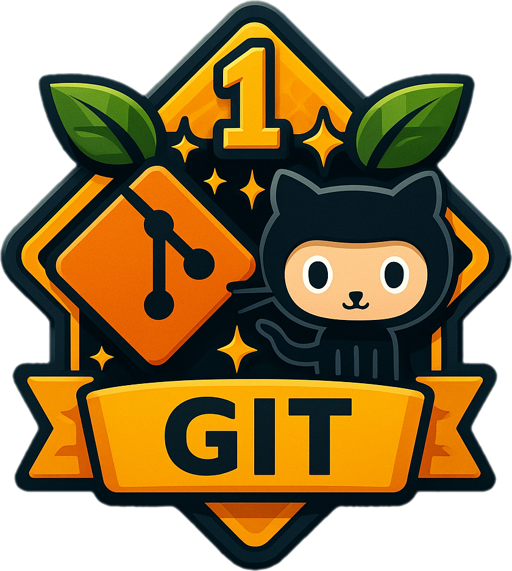

# Jornada Gamificada de Git e GitHub

<table data-header-hidden><tbody><tr><td></td><td>Vamos explorar juntos o <strong>universo do Git e do GitHub</strong>, aprendendo desde os conceitos fundamentais de <strong>versionamento de código</strong> até técnicas mais avançadas de <strong>colaboração e manipulação de histórico</strong>. A cada nível, vamos desbloquear novos conhecimentos, sempre com tarefas práticas e objetivos claros, para que você ganhe confiança ao versionar seus projetos!</td></tr></tbody></table>

## 🕹️ Objetivo

Aprender os conceitos fundamentais de versionamento de código até técnicas mais avançadas de colaboração e manipulação de histórico.

## 🗺️ Jornada

<table><thead><tr><th width="95">Nº</th><th>Níveis</th><th>Descrição</th></tr></thead><tbody><tr><td>Nível 1</td><td><a href="nivel-1-conhecendo-o-universo/o-que-e-versionamento-de-codigo.md">Conhecendo o Mundo</a></td><td>Compreenda o cenário: por que versionar código, o que é Git, o que é GitHub, e como tudo se conecta.</td></tr><tr><td>Nível 2</td><td><a href="nivel-2-preparando-o-ambiente/instalando-o-git.md">Preparando o Ambiente</a></td><td>Configure o Git na sua máquina e crie seu primeiro repositório local.</td></tr><tr><td>Nível 3</td><td><a href="nivel-3-rastreando-mudancas/entendendo-commits-e-status.md">Rastreando Mudanças</a></td><td>Aprenda a salvar e rastrear o progresso do seu projeto com comandos fundamentais.</td></tr><tr><td>Nível 4</td><td><a href="nivel-4-trabalhando-com-branches/criando-uma-nova-branch.md">Trabalhando com Branches</a></td><td>Desenvolva funcionalidades isoladas sem bagunçar o código principal.</td></tr><tr><td>Nível 5</td><td><a href="nivel-5-integrando-com-github/conectando-seu-repositorio-local-ao-github.md">Integrando com o GitHub</a></td><td>Conecte seu repositório ao GitHub e aprenda a sincronizar com a nuvem.</td></tr><tr><td>Nível 6</td><td><a href="nivel-6-viajando-no-tempo/alterando-a-mensagem-de-um-commit.md">Viajando no Tempo</a></td><td>Refatore o passado e corrija o que ficou para trás com recursos avançadas.</td></tr><tr><td>Nível 7</td><td></td><td>Contribua com projetos, abra PRs e trabalhe em equipe de forma organizada.</td></tr></tbody></table>

### 🪄 Recursos Adicionais

<table><thead><tr><th width="119">Tipo</th><th>Link</th></tr></thead><tbody><tr><td>Curso</td><td><a href="https://www.dio.me/courses/versionamento-de-codigo-com-git-e-github"><strong>Versionamento de Código com Git e GitHub</strong></a> na plataforma da <a href="https://www.dio.me/">DIO</a></td></tr></tbody></table>

Feito com 💛 por [Eli](https://github.com/elidianaandrade).
